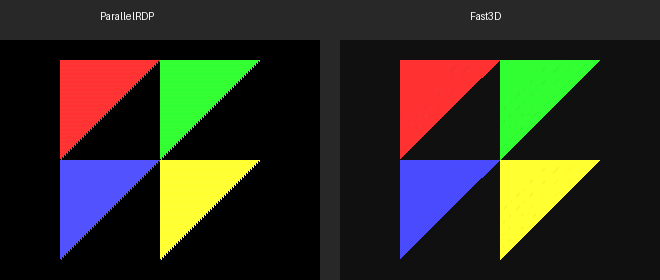
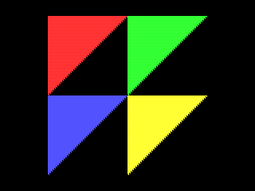
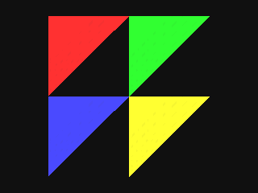

# N64 Mesh Render Comparison: ParallelRDP vs Fast3D

## Mesh

A procedurally generated **diamond octahedron** composed of 4 flat-shaded right-triangles, each a different color (red, green, blue, yellow). This is a CC0/public-domain mesh — no external assets, generated entirely in code.

## Side-by-Side



| | ParallelRDP | Fast3D |
|---|---|---|
| **Image** |  |  |
| **Non-black pixels** | 20,200 | 20,036 |
| **Renderer type** | Hardware-accurate N64 RDP (Vulkan compute) | Display list → VBO → software rasterized |
| **Color combiner** | CC_SHADE_RGB (1-cycle) | G_CCMUX_SHADE (identity matrix) |

## Compare and Contrast

### Similarities
- **Same mesh, same colors**: Both renderers produce the same 4-triangle diamond with red (top-left), green (top-right), blue (bottom-left), and yellow (bottom-right) faces
- **Nearly identical pixel count**: ~20,000 non-black pixels in both outputs
- **Same overall geometry**: The triangles occupy the same screen regions and form the same diamond shape

### Differences

| Aspect | ParallelRDP | Fast3D |
|--------|-------------|--------|
| **Edge rasterization** | Uses N64's exact fixed-point edge-walking algorithm; produces characteristic stepped/jagged diagonal edges with visible scanline artifacts (especially on yellow triangle) | Uses floating-point barycentric coordinate test; produces smoother, more filled triangle edges |
| **Triangle fill** | Authentic N64 RDP scanline-based fill — the diagonal edge of each right triangle shows stepping patterns where integer scanline positions create aliased boundaries | Per-pixel point-in-triangle test fills every pixel whose center falls inside the triangle boundary |
| **Rendering pipeline** | Full N64 RDP hardware emulation via Vulkan compute shaders (ParallelRDP by Themaister). Processes raw RDP edge/shade coefficients identically to real hardware | Display list interpreter → vertex transformation → VBO capture → software rasterization of captured vertices |
| **Color precision** | N64's native 5-bit-per-channel RGBA16 throughout the pipeline | Float VBO colors (0.0–1.0) quantized to 5-bit at final framebuffer write |
| **Scanline artifacts** | The yellow and other triangles show visible horizontal banding/striping on diagonal edges — this is authentic N64 behavior from the edge coefficient integer math | No scanline artifacts; smooth diagonal edges |

### Key Takeaway

ParallelRDP produces **pixel-accurate N64 output** including the characteristic edge stepping and scanline artifacts that real N64 hardware exhibits. Fast3D produces **visually similar but smoother** output because it uses modern floating-point math and per-pixel coverage testing rather than the N64's fixed-point scanline rasterizer. Both correctly implement the N64 color combiner (shade-only mode) and produce the expected flat-shaded colored triangles.

## How to Reproduce

```bash
# Build with ParallelRDP tests
cmake -H. -Bbuild-prdp -GNinja \
  -DCMAKE_BUILD_TYPE=Debug \
  -DLUS_BUILD_TESTS=ON \
  -DLUS_BUILD_PRDP_TESTS=ON
cmake --build build-prdp

# Run the screenshot test (requires Vulkan — lavapipe works for CI)
VK_ICD_FILENAMES=/usr/share/vulkan/icd.d/lvp_icd.json \
SDL_VIDEODRIVER=dummy SDL_AUDIODRIVER=dummy \
./build-prdp/tests/lus_tests --gtest_filter="*MeshScreenshot*"

# Output files:
#   /tmp/prdp_mesh_render.ppm   (ParallelRDP)
#   /tmp/fast3d_mesh_render.ppm (Fast3D)
```
