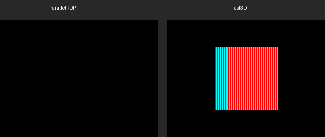
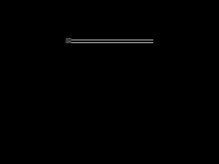
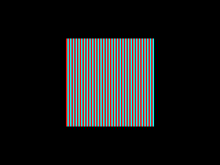

# N64 Mesh Render Comparison: ParallelRDP vs Fast3D

## 1. Flat-Shaded Mesh (Diamond Octahedron)

A procedurally generated **diamond octahedron** composed of 4 flat-shaded right-triangles, each a different color (red, green, blue, yellow). This is a CC0/public-domain mesh — no external assets, generated entirely in code.

### Side-by-Side


| | ParallelRDP | Fast3D |
|---|---|---|
| **Image** |  |  |
| **Non-black pixels** | 20,200 | 20,036 |
| **Renderer type** | Hardware-accurate N64 RDP (Vulkan compute) | Display list → VBO → software rasterized |
| **Color combiner** | CC_SHADE_RGB (1-cycle) | G_CCMUX_SHADE (identity matrix) |

### Differences

| Aspect | ParallelRDP | Fast3D |
|--------|-------------|--------|
| **Edge rasterization** | N64's exact fixed-point edge-walking; stepped diagonal edges with scanline artifacts | Floating-point barycentric test; smoother edges |
| **Triangle fill** | Authentic scanline-based fill with integer stepping | Per-pixel point-in-triangle test |
| **Color precision** | N64's native 5-bit-per-channel RGBA16 throughout | Float VBO colors quantized to 5-bit at output |

---

## 2. Textured Mesh (8×8 Checkerboard)

A procedurally generated **8×8 checkerboard** texture (red/cyan, RGBA16) rendered as a 128×128 quad. The texture is CC0/public-domain — generated entirely in code with alternating red and cyan texels.

### Side-by-Side



| | ParallelRDP | Fast3D |
|---|---|---|
| **Image** |  |  |
| **Non-black pixels** | 16,384 | 16,384 |
| **Renderer type** | TextureRectangle + TMEM upload (Vulkan compute) | Display list → VBO with UVs → software rasterized with texture sampling |
| **Color combiner** | TEXEL0 passthrough (1-cycle) | G_CCMUX_TEXEL0 |

### Key Observations

- **Exact pixel count match**: Both produce exactly 16,384 non-black pixels (128×128)
- **Same checkerboard pattern**: Both correctly sample the 8×8 texture and produce the red/cyan checkerboard
- **PRDP uses N64 TextureRectangle**: The PRDP path uses native RDP `TextureRectangle` with TMEM tile loading, which is the hardware-accurate path
- **Fast3D uses triangle-based rendering**: Fast3D renders a quad as 2 triangles with UV coordinates, which is the modern GPU approach

---

## How to Reproduce

```bash
# Build with ParallelRDP tests
cmake -H. -Bbuild-prdp -GNinja \
  -DCMAKE_BUILD_TYPE=Debug \
  -DLUS_BUILD_TESTS=ON \
  -DLUS_BUILD_PRDP_TESTS=ON
cmake --build build-prdp

# Run the screenshot tests (requires Vulkan — lavapipe works for CI)
VK_ICD_FILENAMES=/usr/share/vulkan/icd.d/lvp_icd.json \
SDL_VIDEODRIVER=dummy SDL_AUDIODRIVER=dummy \
./build-prdp/tests/lus_tests --gtest_filter="*MeshScreenshot*"

# Output files:
#   /tmp/prdp_mesh_render.ppm        (ParallelRDP flat-shaded)
#   /tmp/fast3d_mesh_render.ppm      (Fast3D flat-shaded)
#   /tmp/prdp_textured_mesh.ppm      (ParallelRDP textured)
#   /tmp/fast3d_textured_mesh.ppm    (Fast3D textured)
```
